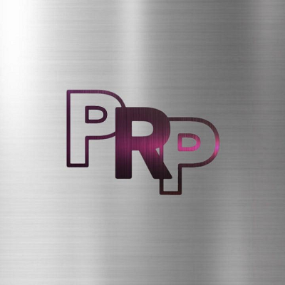

# projekt-strona-PRP
Strona internetowa dla projektu tłumików z tytanu firmy "Polish Racing Power-PRP"

# Projekt Tłumiki z Tytanu

## Opis projektu
Strona internetowa dla naszej firmy zajmującej się produkcją i sprzedażą wysokiej jakości tłumików motocyklowych wykonanych z tytanu. Projekt ma na celu stworzenie nowoczesnej, profesjonalnej i funkcjonalnej strony, która zaprezentuje nasze produkty oraz umożliwi bezpośredni kontakt i zakup online.

## Główne funkcje strony
- **Strona główna**: Przedstawienie oferty oraz głównych atutów tłumików z tytanu.
- **Produkty**: Sekcja z opisami i zdjęciami tłumików oraz opcją zakupu.
- **Blog**: Regularnie publikowane artykuły związane z motocyklami i technologią tłumików.
- **Kontakt**: Formularz kontaktowy oraz integracja z mediami społecznościowymi.
- **SEO i Analityka**: Integracja z narzędziami Google Analytics, Bing UET oraz pełna optymalizacja pod kątem SEO.

## Technologie
- **HTML5, CSS3, JavaScript**: Tworzenie struktury, stylu i interakcji na stronie.
- **Responsive Design**: Strona jest responsywna i dostosowuje się do różnych rozdzielczości ekranów.
- **SEO i Meta Tagi**: W pełni zoptymalizowane meta tagi oraz struktura SEO-friendly.
- **Analityka i Pixel**: Integracja z narzędziami analitycznymi, takimi jak Google Analytics, Facebook Pixel oraz inne platformy reklamowe.

## Jak uruchomić projekt lokalnie
1. Sklonuj repozytorium:
   ```bash
   git clone https://github.com/twoje_konto/nazwa_repozytorium.git
